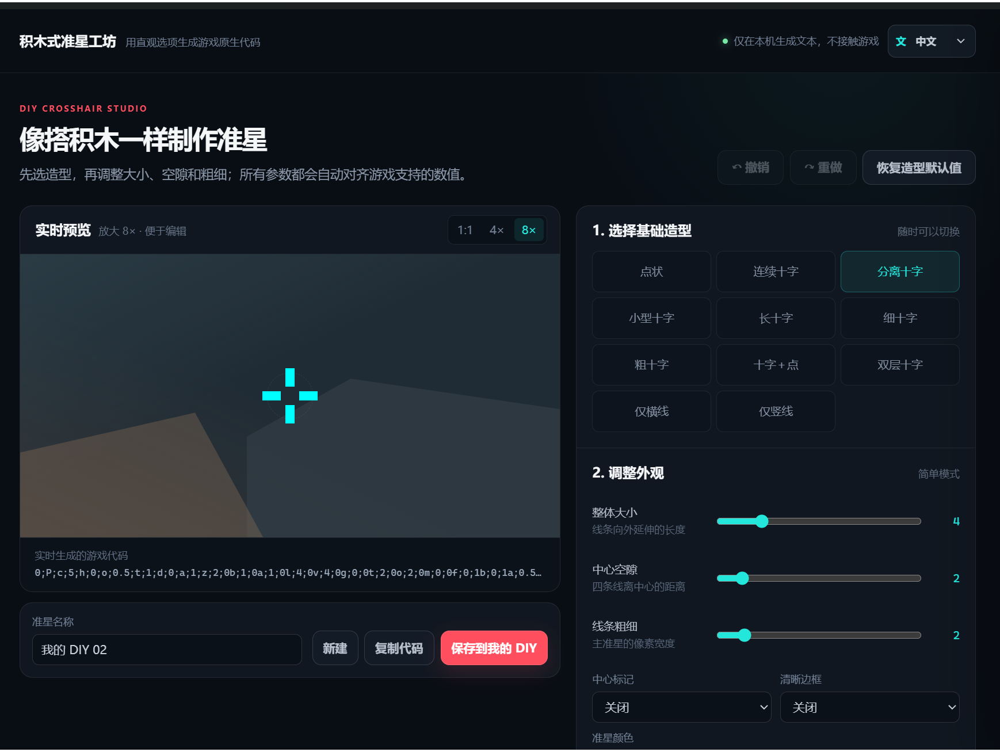

# 准星匣：无畏契约 DIY 准星工具

<p align="center">
  
</p>

<p align="center">
  更简单、更快捷的《无畏契约》可视化 DIY 准星工具与离线准星图鉴。<br />
  A faster visual DIY crosshair studio and offline VALORANT crosshair library for Windows.
</p>

<p align="center">
  
  
  
  
</p>

## 简介

准星匣把可视化 DIY 工坊、职业选手公开配置、常用准星和本地收藏集中在一个 Windows 桌面应用中。你不需要理解或手动修改冗长的准星代码：选择喜欢的基础造型，拖动滑块调整大小、空隙和粗细，就能一边预览，一边得到可以直接复制的游戏原生代码。

版本 1.1.0 提供完整的中文和英文界面，首次启动默认使用中文。图鉴卡片和详情预览支持 `1×`、`4×`、`8×`，方便查看线宽、间距、中心点和轮廓细节。

## 核心功能：可视化 DIY 准星工坊

> 从“我想要这样的准星”到生成可用代码，只需选择造型、调整参数和复制代码。



DIY 工坊把原本需要反复修改数字、导入游戏才能确认效果的过程，变成直观的可视化编辑：

| 步骤 | 操作 | 你会得到什么 |
| --- | --- | --- |
| 1 | 从点状、分离十字、细十字、双层十字等 11 种基础造型中选择 | 无需从一长串代码开始 |
| 2 | 拖动滑块调整整体大小、中心空隙、线条粗细等参数 | 参数自动对齐游戏支持的数值，调整更简单 |
| 3 | 使用 `1×`、`4×`、`8×` 实时预览 | 放大观察像素边缘、间距和中心点细节 |
| 4 | 一键复制代码，或命名后保存到“我的 DIY” | 随时导入游戏，也能继续修改和复用 |

它为什么更快：

- **所见即所得**：每次调整都会立即更新预览和准星代码，不必在参数与效果之间猜测。
- **从造型开始**：先选接近目标的模板，再微调几个直观参数，比从零手写代码更省时间。
- **随时反悔**：支持撤销、重做和恢复默认值，可以放心尝试不同组合。
- **方便积累**：满意的作品可保存在“我的 DIY”，以后继续编辑、复制或复用。
- **完全本地**：生成、预览与保存都在本机完成；程序不连接、检测或修改游戏。

## 下载

安装版、便携版和校验文件请前往 [GitHub Releases](../../releases) 下载。发布新版本时，仓库内置的 GitHub Actions 会自动构建 Windows 安装包并添加到对应 Release。

## 主要功能

- 内置 150 枚职业选手公开配置与经典常用准星
- 中国赛区、职业选手、收藏、最近查看和形态分类
- 按名称、选手 ID、战队、颜色与形态搜索和筛选
- 中文 / English 双语界面，语言选择保存在本机
- 图鉴卡片与详情页提供 `1×`、`4×`、`8×` 像素预览
- 可视化 DIY 准星工坊：11 种基础造型、直观滑块与实时放大预览
- 实时生成游戏原生准星代码，支持撤销、重做、恢复默认值和本地保存
- 导入代码后仅在本地解析、预览和继续编辑
- 一键复制代码到 Windows 剪贴板
- 同时支持安装版与便携版

## 安全边界

准星匣不是游戏插件、外挂或覆盖工具：

- 不检测、启动或监听游戏进程
- 不读取游戏内存、文件、安装目录、配置或注册表
- 不注入 DLL，不创建游戏覆盖层或准星悬浮窗
- 不模拟键鼠输入，不自动导入准星
- 不访问网络；Electron 主进程会拦截 HTTP/HTTPS 请求
- 仅在用户点击复制按钮时写入 Windows 剪贴板

复制代码后，请自行进入游戏的准星设置页面，使用游戏官方导入功能粘贴。

## 开发与构建

需要 Node.js、pnpm 和 Windows 环境。

```powershell
pnpm install
pnpm start
```

常用命令：

```powershell
pnpm check        # 校验 150 枚准星目录与字段
pnpm test:smoke   # Electron 功能与像素绘制回归测试
pnpm dist         # 构建 NSIS 安装版与便携版
```

维护者发布版本时，在 GitHub 的 Releases 页面创建并发布对应标签（例如 `v1.1.0`）即可触发自动构建。发布说明模板见 [`RELEASE_NOTES_1.1.0.md`](RELEASE_NOTES_1.1.0.md)。

项目结构：

```text
assets/      应用图标
electron/    Electron 主进程与安全预加载脚本
scripts/     目录校验、回归测试和安全审计
src/         界面、双语文本、准星目录与绘制逻辑
```

## 本地数据

- 安装版：数据保存在当前 Windows 用户的应用数据目录。
- 便携版：数据保存在程序旁的 `准星匣-data` 文件夹。
- 收藏、最近查看、本地导入、DIY 准星和语言偏好均只保存在本机。

## 数据与免责声明

职业选手准星整理自公开设置资料并记录核验日期。选手可能随时更换配置，因此应用展示的是公开资料中曾核验的记录，不代表永久或实时设置。

本项目并非 Riot Games 或 VALORANT 官方产品。VALORANT 及相关商标归其各自权利人所有。

## English

Crosshair Vault is a fully offline Windows desktop app built around a fast visual DIY workflow. Pick one of 11 base shapes, adjust size, gap, thickness, outlines, center markers, and colors with straightforward controls, then inspect the result instantly at `1×`, `4×`, or `8×`. The game-native code updates as you edit, so you can copy it immediately or save the design to **My DIY** for later changes—without manually decoding a long parameter string.

Version 1.1.0 also includes Chinese and English interfaces, 150 built-in presets, VCT China and pro-player collections, local favorites, undo/redo, and pixel-accurate previews.

The app never accesses the game process, memory, files, registry, or anti-cheat components. It only writes text to the Windows clipboard when the user explicitly selects Copy.

## License

源代码使用 [MIT License](LICENSE) 发布。

